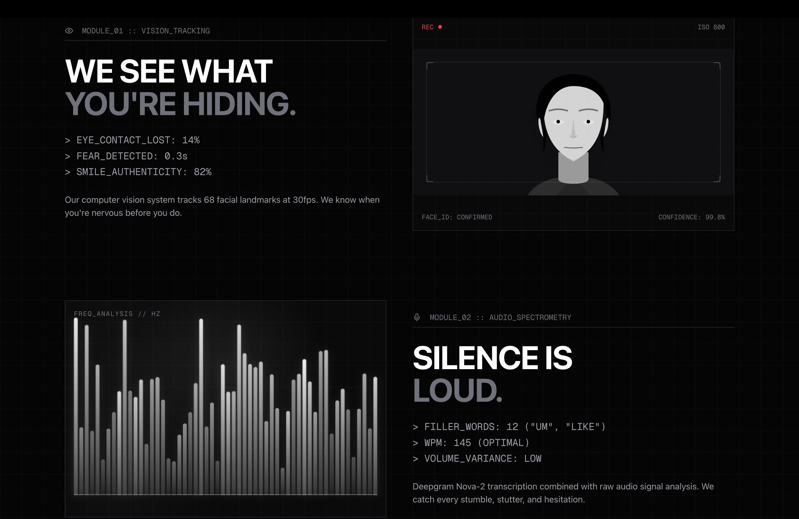
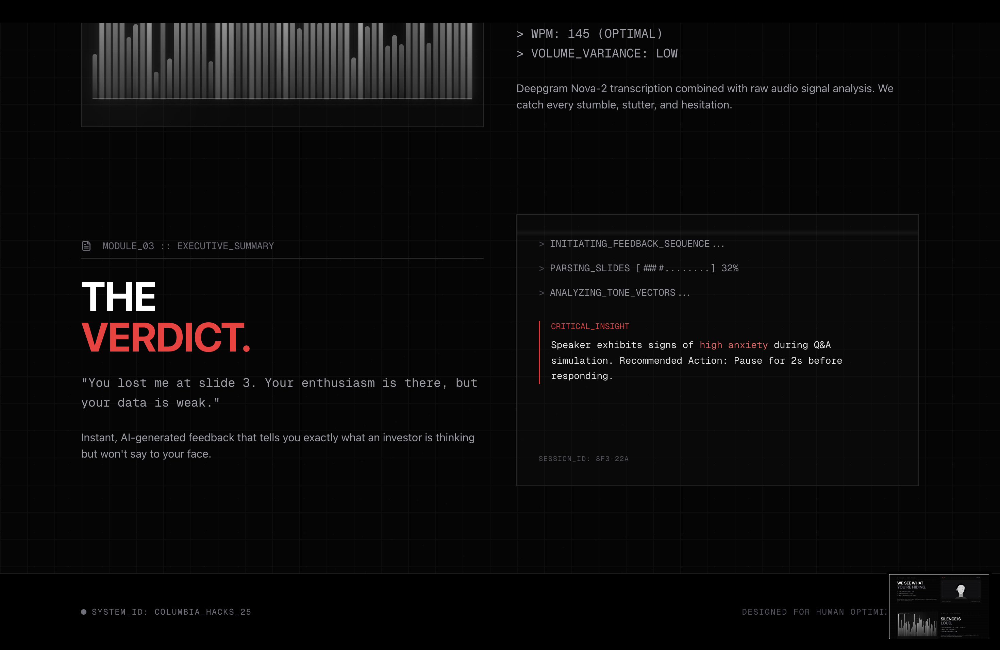

## Project Description — PitchPerfect

**PitchPerfect** is a **machine learning–driven real-time pitch coaching system**, developed as part of a **Machine Learning project under Prof. Sundeep Rangan at New York University (NYU)**.

The motivation behind this project stems from a harsh reality in the startup ecosystem: most startups do not fail due to weak technology or poor ideas, but because founders are unable to communicate their vision under pressure convincingly.

Open [http://localhost:3000](http://localhost:3000) or https://pitch-perfect-id44.vercel.app/ with your browser to see the result.

### Why This Problem Matters

Data highlights the challenge clearly:

- Only **0.05% of startups** both receive venture funding and eventually succeed  
- Investors spend an average of **3 minutes and 44 seconds** reviewing a pitch deck  
- Many investment decisions are made by **slide three**, largely driven by delivery quality  
- Traditional pitch coaching costs between **$1,500–$10,000**, making it inaccessible  
- Generic AI meeting tools do not understand **fundraising psychology** or **investor risk perception**

Existing tools are not built for this high-stakes moment.

---

## 🧠 What I Built

I built **PitchPerfect**, a **real-time AI pitch coach** that functions like a *Gordon Ramsay–style evaluator* for startup pitches.

The system watches your slides, listens to your voice, and analyzes your facial expressions and body language to identify the exact moments where **confidence, clarity, or persuasion breaks down**.

The core objective is to **lower an investor’s perceived risk** by improving pitch delivery at the moments that matter most.

I utilized vibe engineering tools like **Claude**, **Cursor**, and **Anthropic** for designing.

---

## 📱 App Screenshots

### Landing Page


### Module View



###Live Demo


---

## ⚙️ How the System Works

### 1. Pitch Setup
- Users upload their pitch deck  
- Select criticism and evaluation modes  
- Begin pitching in real time  

### 2. Multimodal Analysis Pipeline

**Slide & Content Evaluation**
- Pitch decks are analyzed using **Lovable** and **Claude**
- Narrative flow, clarity, and slide-level structure are evaluated  

**Voice Analysis**
- A real-time voice agent evaluates:
  - Speaking pace  
  - Tone modulation  
  - Clarity and articulation  
  - Jargon density and confidence markers  

**Facial & Body Language Analysis**
- Uses **FaceAPI.js** for real-time facial expression recognition  
- Tracks behavioral signals such as:
  - Eye contact avoidance  
  - Eyebrow movements indicating uncertainty  
  - Lip biting, posture shrinkage, and stress cues  

---

## 🚨 Real-Time Intervention

The system immediately interrupts and alerts the speaker when:
- Speech becomes rushed  
- Narrative structure degrades  
- Facial expressions signal doubt or stress  
- Confidence drops during critical slides (e.g., financials)

Actionable feedback is provided on:
- Correcting posture  
- Controlling voice and pacing  
- Resetting presence and confidence  

---

## 📊 Feedback & Scoring

After each session, users receive a **comprehensive delivery score** across:

- Clarity  
- Timing  
- Confidence  
- Persuasion signals  

These scores are grounded in **real VC attention data**, not generic presentation metrics.

---

## 🏆 Key Differentiator

**PitchPerfect** is highly specialized.

Instead of being a general-purpose meeting assistant, it encodes:
- Investor psychology  
- Fundraising soft-skills research  
- High-stakes pitch delivery rules  

This makes it valuable for:
- Startup founders  
- Accelerators and incubators  
- Venture capital firms  

as a **mandatory pre-flight check before investor meetings**.

---

## 🛠 Current Implementation Status

During the hackathon, we successfully implemented:

- Pitch deck upload and slide analysis  
- Real-time speech transcription  
- Facial expression recognition and behavioral cues  
- Initial interruption and feedback rules  
- End-to-end real-time coaching workflow  

---

## 🌍 Vision

We imagine a world where **no founder walks into a VC meeting without running their pitch through The PitchEx first**.

We are not changing the amount of capital in the ecosystem.  
We are increasing the number of founders who are truly ready to earn it.


This is a [Next.js](https://nextjs.org) project bootstrapped with [`create-next-app`](https://nextjs.org/docs/app/api-reference/cli/create-next-app).

## Getting Started

First, run the development server:

```bash
npm run dev
# or
yarn dev
# or
pnpm dev
# or
bun dev
```

You can start editing the page by modifying `app/page.tsx`. The page auto-updates as you edit the file.

This project uses [`next/font`](https://nextjs.org/docs/app/building-your-application/optimizing/fonts) to automatically optimize and load [Geist](https://vercel.com/font), a new font family for Vercel.

---
## Deploy on Vercel

The easiest way to deploy your Next.js app is to use the [Vercel Platform](https://vercel.com/new?utm_medium=default-template&filter=next.js&utm_source=create-next-app&utm_campaign=create-next-app-readme) from the creators of Next.js.

Check out our [Next.js deployment documentation](https://nextjs.org/docs/app/building-your-application/deploying) for more details.

---

## Connect

ha3290@nyu.edu
